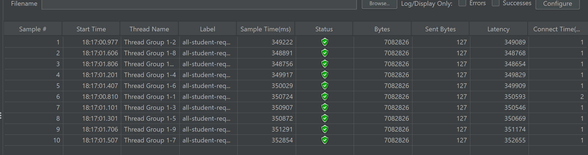
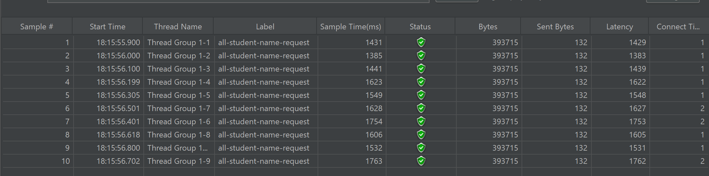
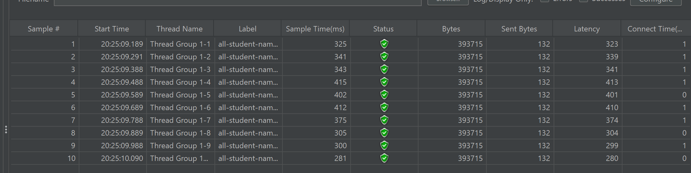
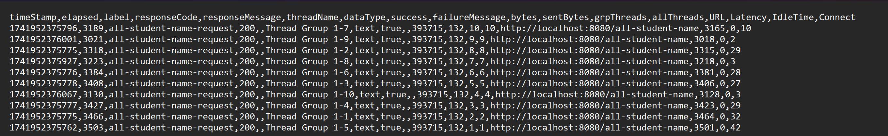
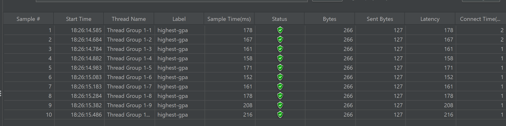
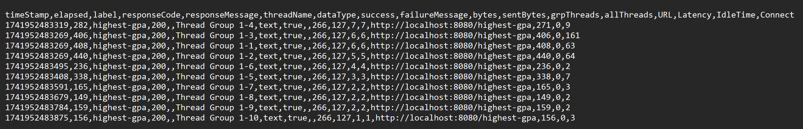

## Screenshots:
### 1. all-student:
Before Optimization:

After Optimization:

Log CLI:

### 2. all-student-name:
Before Optimization:

After Optimization:

Log CLI:

### 3. highest-gpa:
Before Optimization:

After Optimization:

Log CLI:

1. After the profiling and performance optimization process is completed, perform a performance test again using JMeter, see the results, and compare with the first measurement. Is there an improvement from JMeter measurements? Write your conclusion in the README.md file.
> After implementing optimized SQL queries, performance testing with JMeter revealed an improvement of more than 20%, demonstrating the effectiveness of the optimizations in enhancing system performance. The optimized SQL queries executed super fast and significantly reducing response times.

## Reflections:
1. What is the difference between the approach of performance testing with JMeter and profiling with IntelliJ Profiler in the context of optimizing application performance?
> JMeter simulates real world usage by generating multiple requests to test the application's performance externally, while IntelliJ Profiler provides an internal analysis of code execution, memory usage, and bottlenecks within the application.
2. How does the profiling process help you in identifying and understanding the weak points in your application?
> Profiling helps programmers understand how long each section of code takes to execute, as well as its CPU and memory usage. This allows them to pinpoint inefficient areas and make targeted improvements to enhance performance.
3. Do you think IntelliJ Profiler is effective in assisting you to analyze and identify bottlenecks in your application code?
> Yes, it helps by providing a detailed analysis of each code section, including CPU usage, memory consumption, and execution time.
4. What are the main challenges you face when conducting performance testing and profiling, and how do you overcome these challenges?
> To handle large loads of data or traffic, I use tools like JMeter to simulate scenarios and understand the application's limits. To pinpoint bottlenecks in code, I use IntelliJ Profiler to identify the exact section of the code causing the slowdown.
5. What are the main benefits you gain from using IntelliJ Profiler for profiling your application code?
> The main benefit of IntelliJ Profiler lies in its detailed performance insights, allowing programmers to monitor bottlenecks in each code section. Additionally, its built-in integration within IntelliJ IDEA eliminates the need to install and use external applications, streamlining the profiling process.
6. How do you handle situations where the results from profiling with IntelliJ Profiler are not entirely consistent with findings from performance testing using JMeter?
> I would approach this by ensuring both tools are used in the same environment and by replicating the configurations and network latency to maintain consistency in testing conditions.
7. What strategies do you implement in optimizing application code after analyzing results from performance testing and profiling? How do you ensure the changes you make do not affect the application's functionality?
> I would approach this by prioritizing optimizations based on their impact, ensuring they work as intended by validating with tests and pipelines. I would then implement changes incrementally, rather than making all changes at once,to minimize risks and maintain stability of code.
