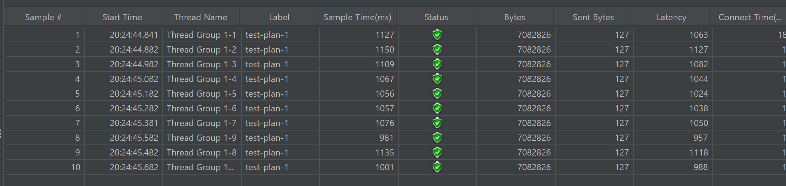
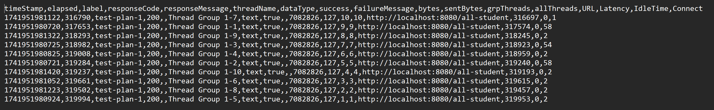
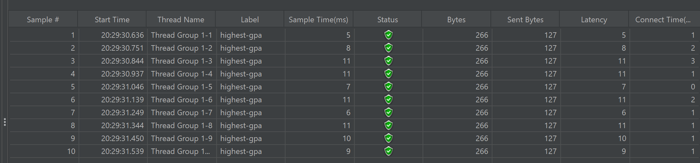

## Screenshots:
### 1. all-student:
Before Optimization:

After Optimization:

Log CLI:

### 2. all-student-name:
Before Optimization:

After Optimization:

Log CLI:

### 3. highest-gpa:
Before Optimization:

After Optimization:

Log CLI:
